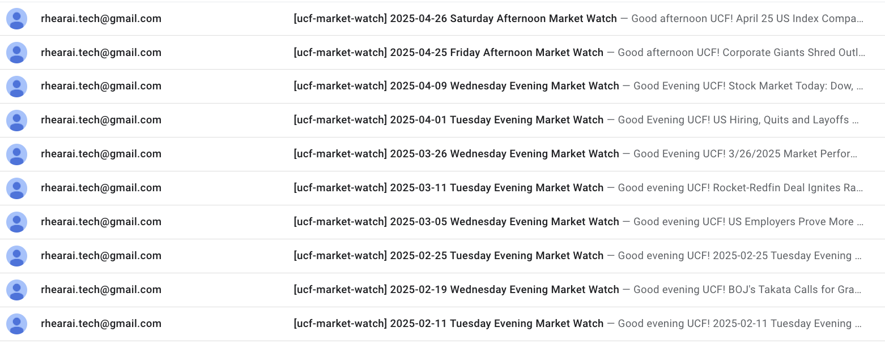
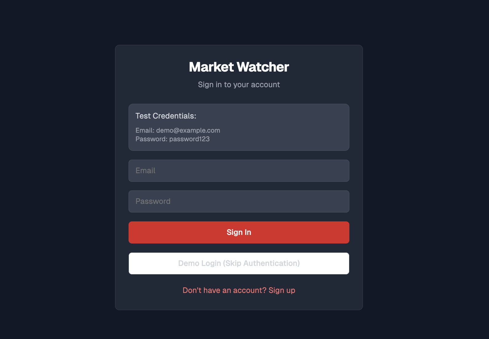
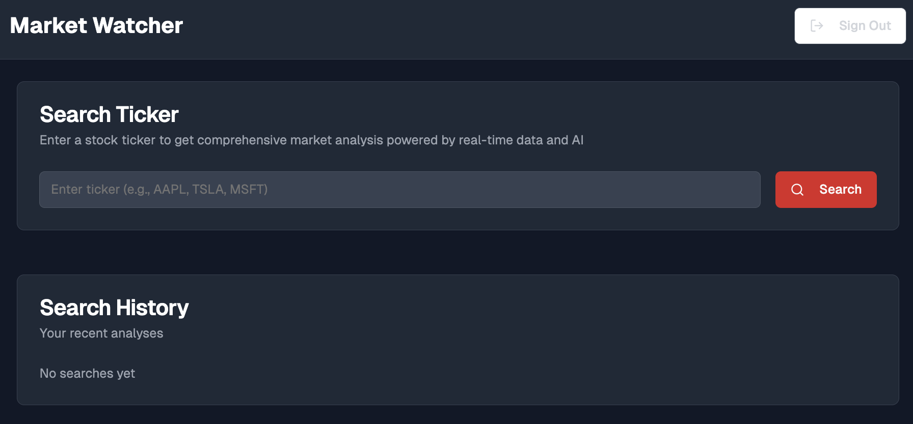
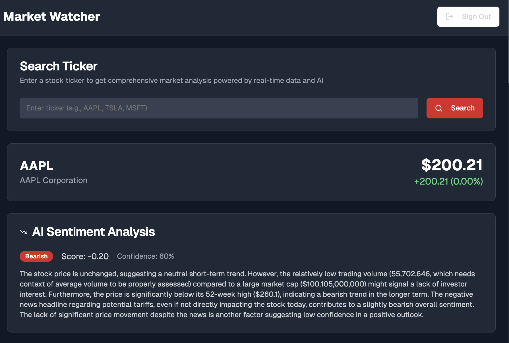
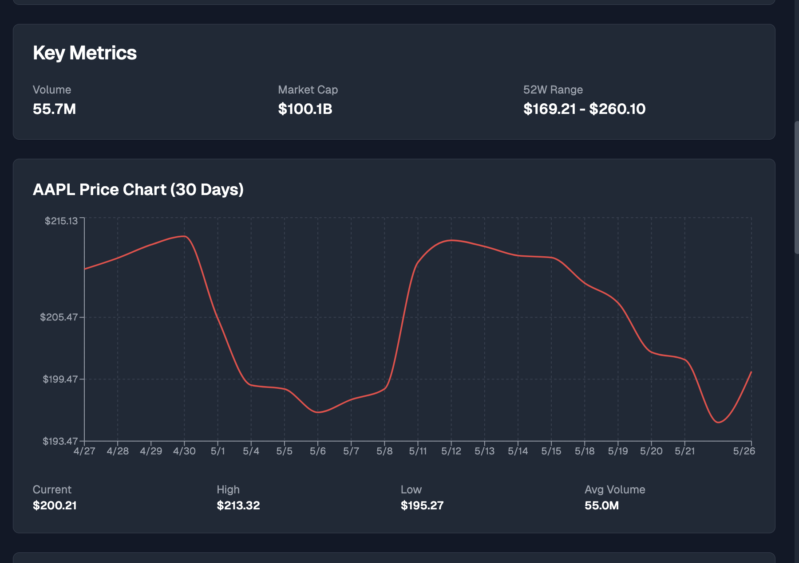
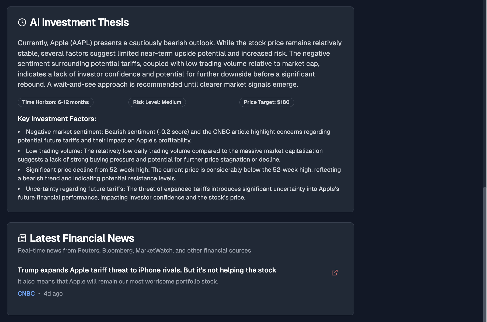
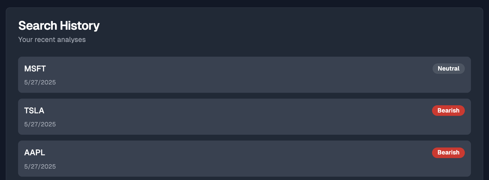

### market watcher

i joined the ut undergraduate computational finance organization this year with some computational but barely any finance knowledge, and suddenly found myself writing weekly market watch reports for the club.

writing unique market watches each week on a time crunch made me realize i needed a faster, smarter way to analyze real-time market data and sentiment. 

as a small project, i built a full-stack ai-powered market analysis platform using next.js, react, supabase, google gemini api, yahoo finance api, vercel (all the free tools i could use, honestly). it provides real-time stock data, llm-sourced sentiment analysis, and personalized investment recommendations, all with user authentication and search history.

### demo 

**login Page**

**dashboard with search**

**real-time stock data**

**analysis/investment summary**

**saved history of past queries with supabase / postgresql**

